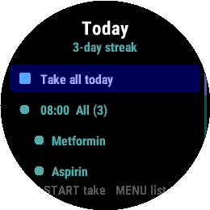
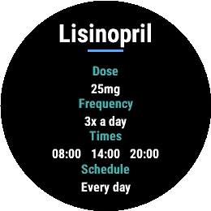
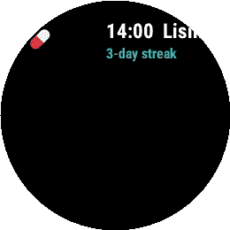

<h1 align="center">💊 MedMinder</h1>

<p align="center">
  <b>A medication tracker and medicine list for your Garmin watch.</b><br>
  Check off your doses, keep a tidy list of everything you take, and never lose track of what's next.
</p>

<p align="center">
  
</p>

<p align="center">
  
  
  
  
</p>

---

## 📸 Screens

<table>
  <tr>
    <td align="center"><br><b>Today</b><br><sub>Doses grouped by time, with a "Take all" and a streak</sub></td>
    <td align="center"><br><b>Medicines</b><br><sub>A clean list — name, dose &amp; frequency</sub></td>
  </tr>
  <tr>
    <td align="center"><br><b>Detail</b><br><sub>Full dose, frequency, times &amp; schedule</sub></td>
    <td align="center"><br><b>Glance</b><br><sub>Your next dose &amp; streak, one swipe away</sub></td>
  </tr>
</table>

---

## ✨ Features

### ✅ Today — track your doses
- **Grouped by time** — meds that share a time collapse under a single header.
- **One-tap "Take all"** — clear a whole time slot, or the whole day, at once.
- **Tap or button** — tap a dose to mark it taken, or use the buttons.
- **Adherence streak** — counts the consecutive days you've taken everything due.
- **Glance** — your next dose and current streak, always one swipe from the watch face.

### 📋 Medicines — your medicine list
- A neat, scrollable catalog of **everything you take** — name, dose, and frequency.
- **Frequency your way** — type it ("3x a day") or leave it blank and MedMinder derives it ("2x daily", "Once daily") from the schedule.
- **Reference-only meds** — list something taken "as needed" with no times, and it stays off your daily reminders.
- **Tap any med** for a full detail card: dose, frequency, times, and which days.

### ✍️ Add your meds
- **In the Garmin Connect app** — open MedMinder's settings and tap **Add** to enter as many medications as you like (name, dose, frequency, times). Truly unlimited.
- Edits sync to the watch automatically; meds you manage on the watch are never overwritten.

### ⌚ Works the way your watch does
- **Buttons and touch** — full button navigation *and* swipe/tap on touchscreen models.
- **Round MIP & AMOLED** — responsive layout drawn in code, from fēnix to Venu to Forerunner.

---

## 🧭 Getting around

```
Glance ─▶ Today ──(MENU / swipe ←)──▶ Medicines ──(tap / START)──▶ Med detail
              ◀───────────────────────  (BACK / swipe →)  ◀──────────────────
```

- **Today:** UP/DOWN to move, **START / tap** to take, **MENU / swipe-left** for your medicine list.
- **Medicines:** scroll, **tap / START** to open a med's detail. **BACK / swipe-right** to go back.

---

## 🛠️ Build & run

Requires the [Connect IQ SDK](https://developer.garmin.com/connect-iq/sdk/) (9.x) and a developer key.

```powershell
# Build + launch in the simulator (fenix7 by default)
.\build.ps1 -Run

# Build for a specific device
.\build.ps1 -Device venu3

# Package a store-ready .iq
.\build.ps1 -Export
```

`build.ps1` reads local paths from `build_config.json` (auto-created on first run — edit it to point at your SDK). Your `developer_key.der` must sit in the project root; it is **git-ignored** and never committed.

---

## 🗺️ Roadmap

- ⏰ **Dose reminders** — background nudges at each scheduled time (a "Take it?" prompt + vibration on supported devices).
- ✍️ **On-watch editor** — add / edit / delete meds and frequency right on the wrist, plus per-dose *skip*.
- 📊 **History** — 7- / 30-day adherence at a glance.
- 🩸 **CGM companion** — a sibling app for live glucose (planned).

---

## 📄 License

MIT © 2026 Christopher Fennell — see [LICENSE](LICENSE).

<sub>Not a medical device. MedMinder helps you remember and record doses; always follow your prescriber's and pharmacist's instructions.</sub>
